<div align="center">


<br/><br/>


### 피부 기록 · 스킨케어 · 생활 데이터를 연결하는 AI Wellness Backend

**낫트데이** (**Not Trouble Day**)의 사용자 데이터를  
**수집 → 검증 → 저장 → AI 분석 → 리포트 → 알림**으로 연결합니다.

<br/>

**Made by Team ToMeta**

<br/>


<br/>

[](https://github.com/LikeLionUniv-INU/14th-toMeta-frontend)
[](https://github.com/LikeLionUniv-INU/14th-toMeta-backend)

<br/>


</div>

</div>

> **낫트데이 Backend**는 사용자의 피부 상태, 사용 화장품, 피부 기록과 Health Connect 생활 데이터를  
> 날짜 단위로 연결하고, 축적된 데이터를 기반으로 Daily · Weekly AI Report를 생성하는 Wellness Backend System입니다.

---

## ✨ Backend at a Glance

| | 핵심 설계 |
| --- | --- |
| 🔐 **Session** | Raw Token을 DB에 저장하지 않는 Hash 기반 Anonymous Session |
| ❤️ **Health Connect** | Android Native 기반 실제 Health Data 수집 및 동기화 |
| 🤖 **AI Report** | OpenAI Responses API + Strict Structured Output + Server Validation |
| 🔎 **Cosmetic Search** | Web Search 기반 화장품 탐색 + 결과 검증 |
| ⚡ **Performance** | Caffeine Cache를 통한 반복 AI Search 최적화 |
| 📸 **Image Storage** | AWS S3 Presigned URL 기반 Direct Upload |
| 🧹 **Image Lifecycle** | Ownership Validation + Orphan Object Cleanup |
| 📊 **Report** | Daily / Weekly AI Report Scheduled Generation |
| 🔔 **Push** | Firebase Cloud Messaging 기반 Report Notification |
| 🗃 **Database** | Flyway Migration + Hibernate Schema Validation |
| 🧪 **Reliability** | Unit · Integration · Migration · Concurrency · Scheduler Test |
| 📱 **Hybrid Integration** | React WebView ↔ Android Native ↔ Spring Backend |

---

## 📑 Contents

- [1. About 낫트데이](#1-about-낫트데이)
- [2. Problem](#2-problem)
- [3. Backend Mission](#3-backend-mission)
- [4. System Architecture](#4-system-architecture)
- [5. Core Data Flow](#5-core-data-flow)
- [6. Domain Architecture](#6-domain-architecture)
- [7. Engineering Highlights](#7-engineering-highlights)
- [8. AI Pipeline](#8-ai-pipeline)
- [9. Health Connect Pipeline](#9-health-connect-pipeline)
- [10. Report & Notification Pipeline](#10-report--notification-pipeline)
- [11. Image Storage Pipeline](#11-image-storage-pipeline)
- [12. Database & Migration](#12-database--migration)
- [13. Reliability & Testing](#13-reliability--testing)
- [14. Tech Stack](#14-tech-stack)
- [15. API Overview](#15-api-overview)
- [16. Deployment](#16-deployment)
- [17. Code Quality & Collaboration](#17-code-quality--collaboration)
- [18. Market & Scalability](#18-market--scalability)
- [19. Track Fit](#19-track-fit)
- [20. Project Structure](#20-project-structure)
- [21. Getting Started](#21-getting-started)
- [22. Team ToMeta](#22-team-tometa)
- [23. References](#23-references)

---

# 1. About 낫트데이

## 🧴 Not Trouble Day

**낫트데이**(**Not Trouble Day**)는  
`Not Trouble Day`, 즉 **피부 트러블로 고민하지 않는 하루**라는 의미를 담고 있습니다.

낫트데이는 피부 문제가 발생한 순간만 관리하는 것보다,

> **매일의 피부와 생활을 기록하고, 변화의 흐름을 이해하는 것**

에서 피부 관리가 시작된다고 생각합니다.

```text
Today's Skin
     +
Cosmetic Routine
     +
Daily Life
     ↓
Personal Skin History
```

사용자가 피부 변화를 기억에 의존하지 않고  
**자신이 쌓아온 기록을 근거로 돌아볼 수 있는 경험**을 만드는 것이 낫트데이의 목표입니다.

---

# 2. Problem

## 피부가 나빠졌을 때, 그 전 며칠의 생활을 얼마나 정확히 기억할 수 있을까요?

여드름은 전 세계 인구의 약 **9.4%**가 영향을 받는 것으로 보고된 흔한 피부 문제입니다.

하지만 피부 상태를 돌아보는 데 필요한 정보는 서로 다른 위치에 흩어져 있습니다.

| 필요한 정보 | 일반적인 위치 |
| --- | --- |
| 피부 상태 | 기억 |
| 사용 화장품 | 화장대 / 기억 |
| 피부 사진 | 사진첩 |
| 수면 데이터 | 건강 앱 |
| 운동 데이터 | 건강 앱 |
| 음식 기록 | 기억 |
| 과거 피부 변화 | 여러 기록에 분산 |

때문에 피부 상태가 변하면 사용자는

> "잠을 적게 자서 그런가?"  
> "최근에 바꾼 화장품 때문인가?"  
> "그날 어떤 제품을 사용했지?"

처럼 과거의 기억을 다시 추측하게 됩니다.

### 우리가 정의한 문제

> **피부와 관련된 데이터가 없는 것이 아니라, 서로 연결되어 있지 않다.**

낫트데이는 피부 상태를 중심으로 화장품과 생활 데이터를 날짜 단위로 연결하여  
**흩어진 데이터를 하나의 Personal Skin History로 만드는 것**을 목표로 합니다.

---

# 3. Backend Mission

Frontend가 사용자의 **기록 경험**을 담당한다면,  
Backend는 그 기록들이 **신뢰할 수 있는 하나의 개인 History로 연결되도록 만드는 역할**을 담당합니다.

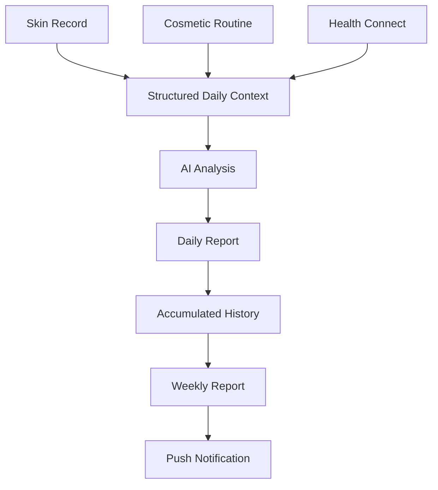

Backend가 해결하는 주요 기술 문제는 다음과 같습니다.

| Challenge | Backend Decision |
| --- | --- |
| 로그인 없이 사용자를 지속 식별 | Hash 기반 Anonymous Session |
| Web에서 Health Connect 직접 접근 불가 | Android Native 수집 → REST Sync |
| AI 자유 응답을 그대로 서비스 데이터로 사용하기 어려움 | Strict JSON Schema + Validation |
| 신제품이 계속 출시되는 화장품 검색 | OpenAI Web Search |
| 반복되는 AI 검색의 Latency / 비용 | Caffeine Cache |
| 피부 이미지가 서버 트래픽을 증가 | S3 Presigned URL Direct Upload |
| 사용되지 않는 S3 Object 발생 | Ownership Tracking + Orphan Cleanup |
| AI 생성 시간이 화면 요청에 영향 | Scheduled Report Generation |
| 한 사용자의 실패가 전체 Batch에 영향 | User-level Failure Isolation |
| Push 전송 도중 상태가 불명확해질 가능성 | Delivery State + Recovery |
| Schema와 Entity 간 불일치 가능성 | Flyway + `ddl-auto=validate` |
| 동일 자원의 동시 접근 | Concurrency Integration Test |

---

# 4. System Architecture

이 Repository는 단순한 Spring REST API Repository가 아닙니다.

**Spring Backend + Android Native Integration + Infrastructure**를 함께 관리합니다.

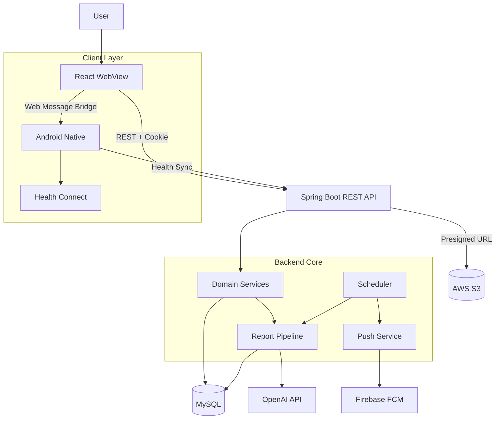

## Responsibility

| Layer | Responsibility |
| --- | --- |
| **React Frontend** | UI · 사용자 입력 · Visualization |
| **Android WebView** | React Application Host |
| **Android Native** | Health Connect · Permission · Background Sync |
| **Spring Boot** | Session · Business Logic · Record · Report · AI Orchestration |
| **MySQL** | 서비스 데이터 영속화 |
| **AWS S3** | 피부 이미지 저장 |
| **OpenAI** | 화장품 검색 및 AI Report 생성 |
| **Firebase FCM** | Push Notification |

> [!NOTE]
> Health Connect는 일반 Web Browser에서 직접 사용할 수 없습니다.
>
> 낫트데이는 `React WebView ↔ Android Native ↔ Health Connect` 구조를 사용하고,  
> 수집된 데이터는 Android Native에서 Spring Backend로 동기화합니다.

---

# 5. Core Data Flow

낫트데이의 핵심 데이터는 **날짜를 중심으로 연결**됩니다.

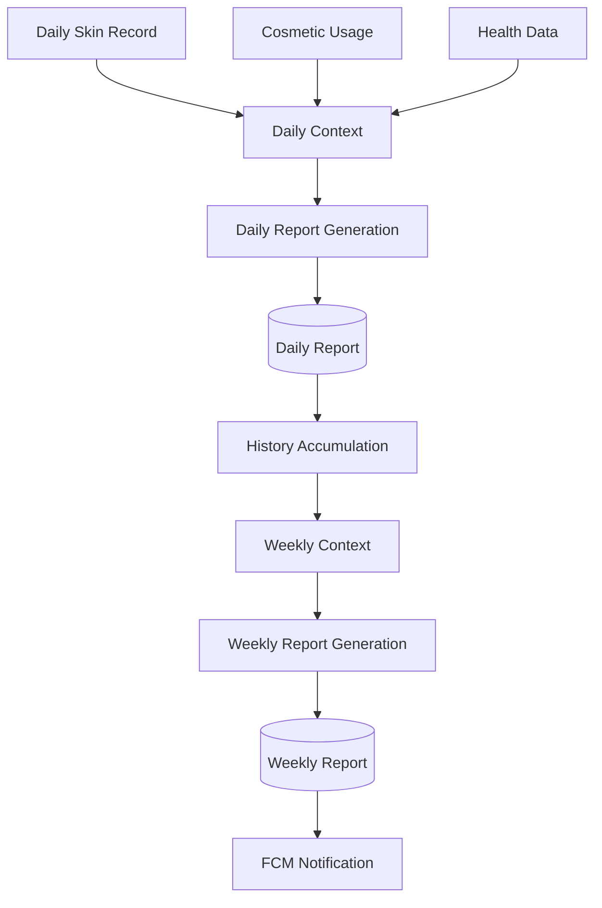

AI에게 Raw Data를 그대로 전달하지 않습니다.

```text
Raw User Data
      ↓
Domain Validation
      ↓
Structured Context
      ↓
OpenAI Request
      ↓
Strict Structured Output
      ↓
Server Validation
      ↓
Persistence
      ↓
Frontend API
```

> [!IMPORTANT]
> **LLM Output ≠ Trusted Application Data**
>
> 낫트데이는 OpenAI의 응답을 그대로 Database에 저장하지 않습니다.  
> Structured Output → Parsing → Domain Validation을 통과한 결과만 서비스 데이터로 사용합니다.

---

# 6. Domain Architecture

Spring Application은 Controller, Service, Repository 전체를 기술 계층별로 모으는 대신  
**Business Domain 중심으로 패키지를 구성**합니다.

```text
📦 com.likelion.tometa
│
├── 📂 domain
│   ├── 🚪 onboarding
│   ├── 👤 user
│   ├── ❤️ health
│   ├── 🧴 cosmetic
│   ├── 📝 record
│   ├── 🤖 report
│   ├── 🏠 home
│   ├── ⚙️ mypage
│   ├── 💡 tip
│   └── common
│
└── 📂 global
    ├── code
    ├── config
    ├── exception
    └── response
```

필요한 Domain 내부에서는 책임을 세분화합니다.

```text
report
├── client
├── code
├── controller
├── dto
├── entity
├── repository
├── scheduler
├── service
└── support
```

## Domain Responsibility

| Domain | Responsibility |
| --- | --- |
| `onboarding` | 약관 동의 및 온보딩 상태 |
| `user` | 사용자 · 익명 세션 · 알림 설정 · Push Token |
| `health` | Health Connect 연결 및 건강 데이터 |
| `cosmetic` | 화장품 검색 · 등록 · 성분 · 스킨케어 세트 |
| `record` | 일일 피부 기록 및 이미지 |
| `report` | Daily / Weekly AI Report |
| `home` | Home Aggregate Data |
| `mypage` | 사용자 설정 |
| `tip` | 스킨케어 Tip |
| `common` | Domain 공통 요소 |

---

# 7. Engineering Highlights

## 7.1 Raw Session Token을 Database에 저장하지 않습니다.

낫트데이 MVP는 사용자가 회원가입·로그인 과정을 거치지 않으면서도  
동일 사용자를 지속적으로 식별할 필요가 있습니다.

이를 위해 **Anonymous Session Cookie**를 사용합니다.

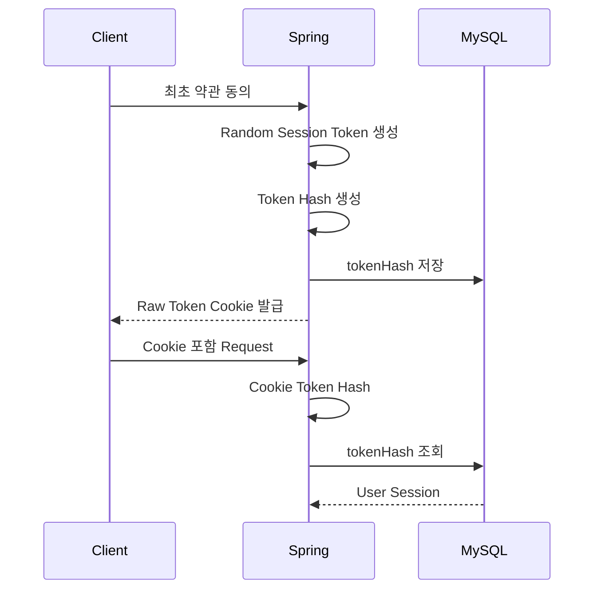

Database에는 사용자가 실제로 가지고 있는 Token 원문이 아니라 **Hash 값만 저장**합니다.

```text
Client
└── Raw Session Token

Database
└── Hash(Session Token)
```

세션을 기준으로 다음 데이터를 동일 사용자에게 연결합니다.

```text
User
├── Consent
├── Profile
├── Health Connection
├── Notification Setting
├── Cosmetic Pouch
├── Daily Record
└── Report
```

---

## 7.2 온보딩 상태를 화면 번호가 아니라 실제 데이터로 판단합니다.

서버가 단순히

```text
currentStep = 3
```

같은 UI 상태를 저장하지 않습니다.

실제 Domain Data를 확인합니다.

```text
Profile Completed?
        +
Active Health Connection?
        +
Notification Setting Exists?
        ↓
Onboarding Status
```

사용자가 앱을 종료하고 다시 실행해도 **실제 저장된 데이터를 기준으로 온보딩을 복구**할 수 있습니다.

---

## 7.3 AI 자유 응답을 그대로 신뢰하지 않습니다.

자연어 기반 LLM Response는 동일한 Prompt에서도 형식이 달라질 수 있습니다.

낫트데이는 OpenAI **Structured Output**을 사용하여 AI Response의 형태를 제한합니다.

```text
OpenAI
  ↓
Strict JSON Schema
  ↓
JSON Parsing
  ↓
Required Field Validation
  ↓
Domain Object
  ↓
Database
```

예를 들어 Daily Report에서는 미리 정의한 필드를 반드시 반환하도록 제한합니다.

```json
{
  "aiSummary": "...",
  "aiAnalysis": "...",
  "personalizedSolution": "..."
}
```

Schema는 다음과 같은 원칙을 따릅니다.

```text
strict = true
additionalProperties = false
required = all fields
```

AI 응답이 불완전하거나 필수 값이 누락되거나 Parsing에 실패하면 정상 서비스 데이터로 처리하지 않습니다.

---

## 7.4 건강 데이터를 다루는 AI의 추측 범위를 제한합니다.

낫트데이에서는 자연스러운 AI 문장보다 **AI가 어떤 주장을 할 수 있는가**를 중요하게 다룹니다.

```text
제공된 데이터만 사용
       │
       ├── null / empty 값은 근거에서 제외
       ├── 입력에 없는 생활 습관 추측 금지
       ├── 건강 상태 임의 생성 금지
       ├── 직접적인 인과관계 단정 금지
       ├── 의료 진단 금지
       ├── 치료 / 약물 지시 금지
       └── 입력에 없는 화장품 성분 언급 금지
```

예를 들어,

```text
"수면 부족 때문에 피부가 악화되었습니다."
```

와 같이 직접적인 원인을 확정하는 대신,

```text
"짧은 수면 시간과 좋지 않은 피부 상태가 함께 기록되었습니다."
```

처럼 **기록된 사실과 인과관계를 구분**하도록 제한합니다.

> [!CAUTION]
> 낫트데이의 AI Report는 의료 진단, 치료 또는 약물 처방을 목적으로 하지 않습니다.

---

## 7.5 화장품 검색은 모델의 기억보다 현재 Web 정보를 확인합니다.

화장품은 신제품 출시와 단종이 빈번합니다.

따라서 LLM 내부 지식만 사용하지 않고 **OpenAI Web Search**를 활용합니다.

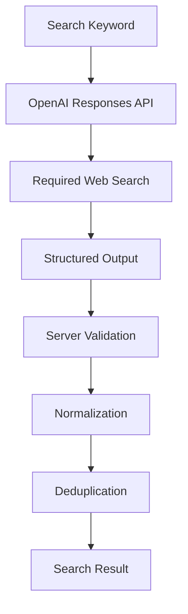

AI Response를 곧바로 사용자에게 반환하지 않고 서버에서 다시 검증합니다.

```text
Product Name
├── Blank 제거
└── 중복 제거

Product Type
└── Backend Enum 허용값만 통과

Main Ingredients
├── Blank 제거
├── 중복 제거
└── 최대 3개

Image URL
└── http / https 검증

Result
└── 최대 5개
```

즉,

> **AI Search Result = Trusted Service Data**

라고 가정하지 않습니다.

AI의 결과는 **후보 데이터**로 취급하고 Domain Rule을 다시 적용합니다.

---

## 7.6 반복 AI 검색을 Cache합니다.

Web Search가 포함된 AI 요청은 일반 DB 조회보다 느리고 비용이 큽니다.

동일한 검색어가 짧은 시간 동안 반복될 경우 **Caffeine Local Cache**를 사용합니다.

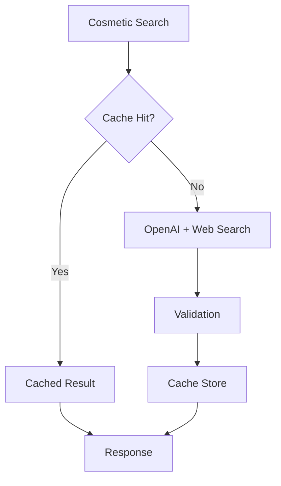

Cache에는 만료 시간과 최대 크기를 두어 무제한 메모리 증가를 방지합니다.

```text
Expiration   : 10 minutes
Maximum Size : 1,000 entries
```

---

## 7.7 피부 이미지는 Application Server가 중계하지 않습니다.

이미지를

```text
Client → Spring → S3
```

구조로 전달하면 Backend가 이미지 Binary 전체를 받아 다시 전송해야 합니다.

낫트데이는 **AWS S3 Presigned URL** 방식을 사용합니다.

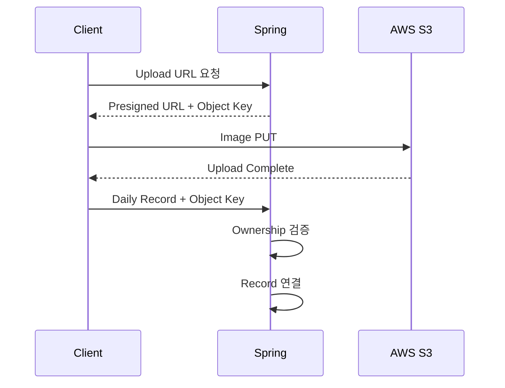

이미지 Binary는

```text
Client → AWS S3
```

로 직접 전송되고 Backend는 **Object Metadata와 소유 관계**를 관리합니다.

---

## 7.8 이미지 Upload 이후의 Lifecycle까지 관리합니다.

Presigned URL 방식에서는 아래와 같은 상황이 발생할 수 있습니다.

```text
① Presigned URL 발급
② S3 Upload 성공
③ Daily Record 저장 전 사용자 이탈
```

이 경우 어떤 Record에도 연결되지 않은 S3 Object가 남습니다.

이미지 책임을 기능별로 분리합니다.

```text
RecordImageStorageService
        │
        ├── Presigned URL
        │
RecordImageOwnershipService
        │
        ├── 사용자 소유권
        │
DailyRecordImageAttachmentService
        │
        ├── Record 연결
        │
RecordImageReadUrlService
        │
        ├── 조회 URL
        │
RecordImageOrphanCleanupService
        │
        └── 미사용 객체 정리
```

즉, 단순한 Upload 기능을 넘어서

> **Upload → Ownership → Attachment → Read → Cleanup**

전체 Image Lifecycle을 관리합니다.

---

# 8. AI Pipeline

낫트데이에서 AI는 크게 두 가지 역할을 담당합니다.

## 8.1 Cosmetic Search

```text
Keyword
   ↓
OpenAI Responses API
   ↓
Required Web Search
   ↓
Structured Output
   ↓
Server Validation
   ↓
Normalization
   ↓
Cache
   ↓
Frontend
```

목적은 AI가 화장품을 만들어내는 것이 아니라  
**현재 Web에서 실제 제품 후보를 탐색하는 검색 Interface**로 사용하는 것입니다.

---

## 8.2 Daily / Weekly Report

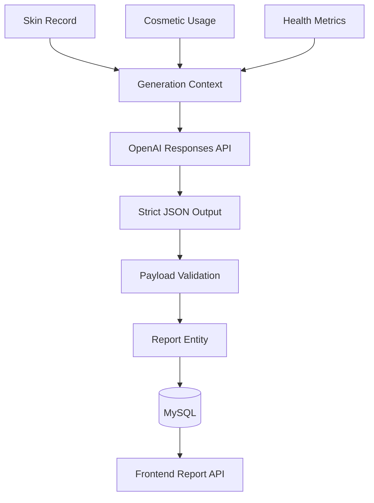

AI 호출을 Controller가 직접 담당하지 않습니다.

```text
Controller
    ↓
Application Service
    ↓
Generation Context
    ↓
AI Client
    ↓
Structured Output
    ↓
Validation
    ↓
Persistence
```

각 계층의 책임을 분리합니다.

---

## Why Structured Output?

AI가 자유로운 자연어를 반환하도록 두면

```text
필드 누락
형식 변경
추가 설명 삽입
Parsing 실패
```

가 Application Error로 이어질 수 있습니다.

따라서 낫트데이는

> **LLM Output을 외부 시스템에서 전달된 Untrusted Response로 취급합니다.**

---

# 9. Health Connect Pipeline

Health Connect 접근은 Android Native Layer에서 담당합니다.

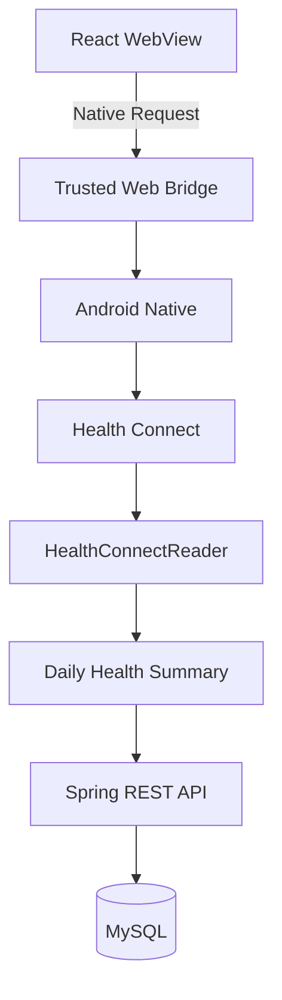

## Web ↔ Native Bridge

React WebView는 `ToMetaNative` Message Bridge를 통해 Android 기능을 요청합니다.

주요 Native 기능:

```text
Health Connect Permission
Health Data Synchronization
Push Permission
```

Native Bridge는 모든 Web Page에 무조건 열려 있지 않습니다.

```text
Message
   ↓
Main Frame?
   ↓
Trusted Origin?
   ↓
Valid Message?
   ↓
Supported Command?
   ↓
Native Action
```

허용된 Origin의

```text
Scheme
Host
Port
```

를 확인한 뒤 Native 기능을 실행합니다.

> [!IMPORTANT]
> `ToMetaNative`는 서비스명 변경과 무관한 **실제 코드 Identifier**이므로 그대로 유지합니다.

---

## Health Data Aggregation

Android에서는 Health Connect Raw Record를 날짜 단위 요약 데이터로 변환합니다.

| Health Connect Record | 낫트데이에서 사용하는 값 |
| --- | --- |
| `SleepSessionRecord` | 일일 수면 시간 |
| `ExerciseSessionRecord` | 일일 운동 시간 |
| `TotalCaloriesBurnedRecord` | 일일 소모 칼로리 |
| `SkinTemperatureRecord` | 평균 피부 온도 |
| `OxygenSaturationRecord` | 평균 산소포화도 |
| `MenstruationPeriodRecord` | 생리주기 Day |

Aggregate API를 활용할 수 있는 데이터는 Health Connect에서 집계하고,  
개별 Record가 필요한 데이터는 날짜 범위에 맞게 계산합니다.

---

## Pagination

Health Connect의 Record가 한 Request에 모두 포함된다고 가정하지 않습니다.

```text
Read Records
    ↓
pageToken 존재?
    │
    ├── Yes → Next Page
    │
    └── No  → Complete
```

Pagination을 반복하여 데이터를 누락하지 않도록 합니다.

---

## Background Sync

Android Layer에는 WorkManager 기반 Background Sync 구조가 있습니다.

```text
WorkManager
     ↓
HealthSyncWorker
     ↓
Health Connect
     ↓
Daily Health Summary
     ↓
Spring Backend
```

Health Connect를 단순 권한 요청 기능으로 끝내지 않고  
**수집 → Aggregation → Backend Sync**의 Lifecycle로 구성합니다.

---

# 10. Report & Notification Pipeline

사용자가 Report 화면에 들어오는 시점과 AI 생성 시점을 분리합니다.

잘못된 구조:

```text
User opens Report
       ↓
OpenAI Request
       ↓
Wait
       ↓
Render
```

낫트데이:

```text
Scheduler
    ↓
AI Report Generation
    ↓
Persistence

--------------------

User
    ↓
Report API
    ↓
Stored Report
```

Frontend의 사용자 경험이 OpenAI API Latency에 직접 종속되지 않도록 합니다.

---

## Daily Report

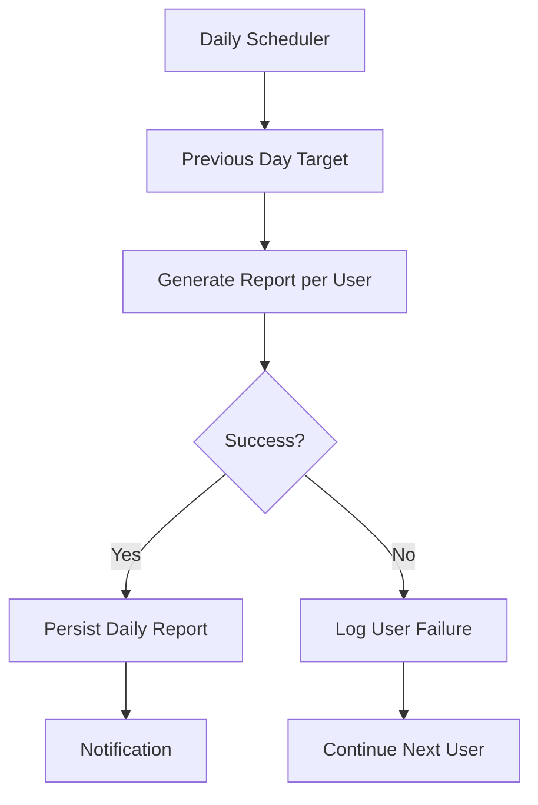

### User-level Failure Isolation

한 사용자의 OpenAI 요청 실패가 전체 Batch를 중단하지 않습니다.

```text
User A → Success
User B → OpenAI Failure
User C → Success
```

결과:

```text
User A → Save
User B → Failure Log
User C → Save
```

사용자 단위로 실패를 격리하고 다음 대상의 처리를 이어갑니다.

---

## Weekly Report

```text
Previous Monday
      ↓
       ...
      ↓
Previous Sunday
      ↓
Weekly Context
      ↓
OpenAI
      ↓
Validation
      ↓
Weekly Report
      ↓
Persistence
```

일주일 동안 축적된 피부 상태, 생활 데이터와 기록을 하나의 Weekly Context로 구성합니다.

---

## Firebase Push Notification

Report 생성 이후 Firebase Cloud Messaging을 통해 알림을 전달합니다.

```text
Generated Report
      ↓
Notification Target
      ↓
PushNotificationService
      ↓
FcmPushService
      ↓
Firebase Cloud Messaging
      ↓
Android Device
```

Token 관리와 FCM 전송 책임을 분리합니다.

```text
PushTokenService
└── Token Lifecycle

FcmPushService
└── External FCM Request

PushNotificationService
└── Notification Orchestration
```

---

## Notification Recovery

외부 Push 시스템 호출 도중 Application이 종료되면

```text
Processing
   ↓
FCM Request
   ↓
Application Failure
   ↓
Final State Unknown
```

과 같은 불확실한 상태가 발생할 수 있습니다.

일정 시간 이상 완료되지 않은 Notification Delivery를 복구 대상으로 판단합니다.

```text
Pending / Processing
        ↓
Stale
        ↓
Recovery
        ↓
Unknown
```

발송 여부를 확인할 수 없는 알림을 정상 성공으로 잘못 처리하지 않도록 합니다.

---

# 11. Image Storage Pipeline

피부 이미지는 일반적인 Business JSON과 별도의 Upload Flow를 사용합니다.

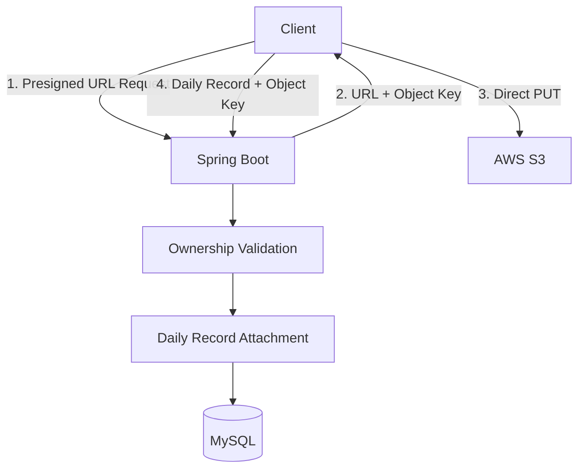

Backend가 관리하는 범위:

```text
File Validation
        ↓
Presigned Upload URL
        ↓
User Ownership
        ↓
Daily Record Attachment
        ↓
Presigned Read URL
        ↓
Orphan Cleanup
```

AWS S3를 단순 File Bucket이 아니라 **Business Data Lifecycle의 일부**로 관리합니다.

---

# 12. Database & Migration

## Flyway as Schema Source of Truth

Database Schema를 Hibernate 자동 생성에 의존하지 않습니다.

```yaml
spring:
  jpa:
    hibernate:
      ddl-auto: validate
```

Hibernate는 Application 실행 시 Schema를 자동으로 변경하는 대신  
**Entity와 실제 Database Schema가 일치하는지 검증**합니다.

Schema 변경은 Flyway Migration으로 관리합니다.

```text
src/main/resources/db/migration/mysql
│
├── V1__baseline_schema.sql
├── V2__seed_ingredients.sql
├── V3__create_cosmetic_tags.sql
├── V4__create_daily_record_registration.sql
├── V5__create_record_image_objects.sql
├── V6__create_daily_record_selections.sql
├── V7__add_daily_report_health_metrics.sql
├── V8__add_weekly_report_status.sql
│
├── ...
│
├── V10__add_daily_record_update_support.sql
├── V11__add_weekly_report_notification_delivery.sql
└── V12__add_weekly_report_notification_attempt_id.sql
```

### Schema Change Flow

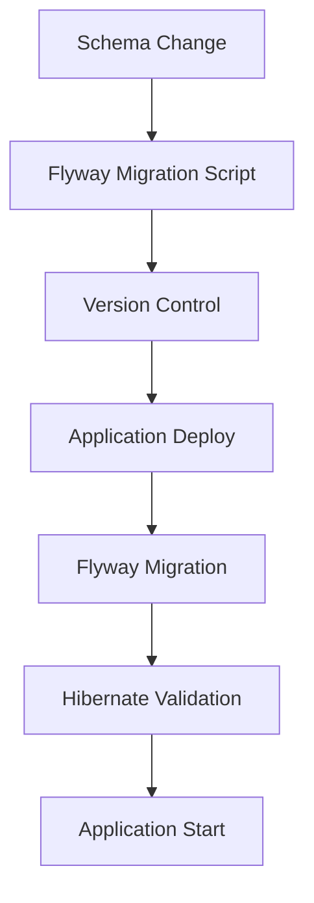

개발자의 로컬 환경 또는 기존 DB 상태에 따라 Schema가 암묵적으로 달라지는 문제를 방지합니다.

---

# 13. Reliability & Testing

낫트데이 Backend는 정상 Request / Response뿐 아니라  
**Persistence, Migration, Scheduler, Image Lifecycle과 Race Condition**까지 테스트합니다.

```text
                  Test Strategy
                        │
        ┌───────────────┼───────────────┐
        │               │               │
      Unit          Integration     Concurrency
        │               │               │
 Domain Logic       Database       Race Condition
 Validation         Migration      Ownership
 Utility            Lifecycle      Cosmetic Set
                        │
                    Scheduler
```

## Test Scope

| Layer | 검증 대상 |
| --- | --- |
| **Unit Test** | Service · Validation · Selector · Utility |
| **Controller Test** | API Boundary |
| **Repository Test** | Query · Persistence |
| **Integration Test** | 실제 DB 기반 Domain Flow |
| **Migration Test** | Flyway Migration 정합성 |
| **Concurrency Test** | 동일 자원 동시 접근 |
| **Scheduler Test** | Report Generation · Notification |

### Representative Tests

```text
FlywayMigrationIntegrationTest

CosmeticSetConcurrencyIntegrationTest
CosmeticSetDetailIntegrationTest

DailyRecordImageReplacementIntegrationTest
RecordImageOwnershipConcurrencyIntegrationTest

DailyRecordServiceTest
DailyRecordImageAttachmentServiceTest

RecordImageStorageServiceTest
RecordImageOwnershipServiceTest
RecordImageOrphanCleanupServiceTest

CosmeticSearchServiceTest
CosmeticSetServiceTest
UserCosmeticServiceTest
```

특히 동시에 동일한 데이터를 변경할 가능성이 있는 영역은  
단순 Unit Test만으로 끝내지 않고 **Concurrency Integration Test**를 별도로 구성합니다.

---

## Time-dependent Logic

Scheduler와 같이 실행 시점에 따라 결과가 달라지는 로직은 테스트에서 시간을 제어할 수 있도록 구성합니다.

```text
Production
└── System Clock

Test
└── Controlled Clock
```

Report 기준 날짜 계산, 알림 Recovery 등 시간에 의존하는 로직을 재현 가능한 형태로 검증합니다.

---

# 14. Tech Stack

<div align="center">

[](https://skillicons.dev)

</div>

<br/>

## Backend Core

| Category | Technology | Role |
| --- | --- | --- |
| Language | **Java 21** | Backend Core |
| Framework | **Spring Boot 4.1.0** | Application Framework |
| Web | **Spring Web MVC** | REST API |
| ORM | **Spring Data JPA** | Persistence |
| Validation | **Bean Validation** | Request Validation |
| Database | **MySQL 8.0** | Primary Database |
| Migration | **Flyway** | Schema Version Management |
| Cache | **Caffeine** | Cosmetic Search Cache |
| Build | **Gradle** | Build / Dependency Management |
| Utility | **Lombok** | Boilerplate Reduction |

---

## AI & External Services

| Category | Technology | Role |
| --- | --- | --- |
| AI | **OpenAI Responses API** | Daily / Weekly Report |
| Search | **OpenAI Web Search** | Cosmetic Search |
| Structured AI | **JSON Schema Structured Output** | AI Response Contract |
| Storage | **AWS S3** | Skin Image |
| AWS SDK | **AWS SDK for Java v2** | S3 Integration |
| Push | **Firebase Admin SDK** | FCM Server Integration |

---

## Android Integration

| Category | Technology | Role |
| --- | --- | --- |
| Language | **Kotlin** | Android Native |
| UI | **Jetpack Compose** | Native UI |
| Health | **Health Connect** | Health Data |
| WebView | **AndroidX WebKit** | React ↔ Native Bridge |
| Background | **WorkManager** | Background Health Sync |
| HTTP | **Retrofit / OkHttp** | Android ↔ Spring |
| Serialization | **kotlinx.serialization** | JSON |
| Push | **Firebase Messaging** | Device Push |

### Android Environment

```text
minSdk     : 28
targetSdk  : 36
compileSdk : 37
```

---

## Infrastructure & Development

| Category | Technology | Role |
| --- | --- | --- |
| Container | **Docker** | Application Packaging |
| Orchestration | **Docker Compose** | Spring + MySQL |
| Runtime | **Eclipse Temurin JRE 21** | JVM Runtime |
| Test | **JUnit Platform** | Automated Test |
| Test DB | **H2** | Test Environment |
| Review | **CodeRabbit** | Automated PR Review |
| Documentation | **Markdown** | API / Tutorial Documentation |

---

# 15. API Overview

상세 Request / Response 명세는 [`docs/api`](./docs/api)에서 관리합니다.

README에서는 서비스의 주요 API Domain만 요약합니다.

| Domain | Responsibility |
| --- | --- |
| `/api/onboarding` | 약관 동의 및 온보딩 상태 |
| `/api/users` | 사용자 Profile / Setting |
| `/api/health-connect` | Health Connect 연결 및 동기화 |
| `/api/home` | Home Aggregate Data |
| `/api/cosmetics` | 화장품 검색 |
| `/api/user-cosmetics` | 사용자 화장품 관리 |
| `/api/cosmetic-sets` | Morning / Night Routine |
| `/api/cosmetic-options` | Record 화장품 선택지 |
| `/api/ingredients` | 화장품 주요 성분 |
| `/api/daily-records` | 피부 일일 기록 |
| `/api/record-images` | 피부 이미지 |
| `/api/reports` | Daily / Weekly Report |
| `/api/push-tokens` | FCM Device Token |

---

## Common Response Format

API 응답은 공통 구조를 사용합니다.

```json
{
  "isSuccess": true,
  "code": "COMMON_200",
  "message": "요청에 성공했습니다.",
  "result": {}
}
```

Error 역시 Domain Error Code를 사용합니다.

```json
{
  "isSuccess": false,
  "code": "USER_4011",
  "message": "사용자 세션을 확인할 수 없습니다.",
  "result": null
}
```

Frontend가 문자열 Message에만 의존하지 않고 **Error Code를 기준으로 사용자 Flow를 처리**할 수 있도록 합니다.

---

# 16. Deployment

## Docker Architecture

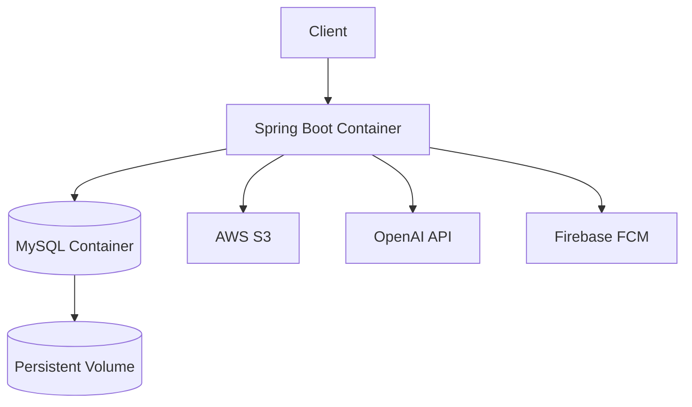

Docker Compose에서는 MySQL Health Check가 성공한 뒤 Application Container를 시작합니다.

```text
MySQL Container
       ↓
Health Check
       ↓
Healthy
       ↓
Spring Boot Container
```

---

## Multi-stage Docker Build

```text
Stage 1
eclipse-temurin:21-jdk
        ↓
Gradle bootJar
        ↓
Application JAR

Stage 2
eclipse-temurin:21-jre
        ↓
Runtime Image
```

Build 환경에는 JDK를 사용하고 실제 Runtime Image에는 JRE를 사용합니다.

Application Runtime Timezone은

```text
Asia/Seoul
```

로 통일합니다.

---

## Container Structure

```text
tometa-app
     +
tometa-mysql
```

MySQL은 Container Network 내부에서

```text
mysql:3306
```

으로 접근합니다.

Application은 Host의

```text
127.0.0.1:8080
```

에 Binding합니다.

---

# 17. Code Quality & Collaboration

## 🐰 CodeRabbit Automated Review

Repository Root의 `.coderabbit.yaml`을 통해 Pull Request 자동 리뷰를 사용합니다.

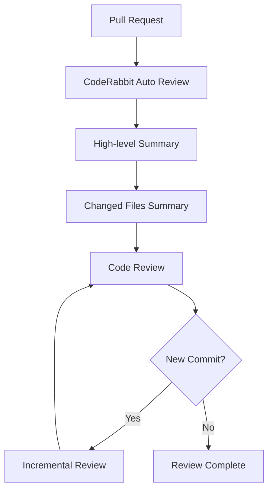

Review 설정에서는 다음 기능을 활용합니다.

```text
High-level Summary
Changed Files Summary
Sequence Diagram
Linked Issue Context
Related PR Context
Incremental Review
Web Search Reference
Auto Reply
```

단순한 문제 지적보다 **왜 문제가 발생하는지와 개선 이유까지 이해하는 리뷰**를 지향합니다.

---

## Documentation

개발 문서는 Source Code와 분리합니다.

```text
docs
├── api
└── tutorial
```

| Document | Responsibility |
| --- | --- |
| `README.md` | Product + System Architecture |
| `docs/api` | Frontend ↔ Backend API Contract |
| `docs/tutorial` | 기능별 상세 설명 |

---

# 18. Market & Scalability

식품의약품안전처에 따르면 2024년 국내 화장품 생산실적은 약 **17조 5,426억 원**을 기록했으며,  
기초화장용 제품 생산액은 **10조 원을 넘어섰습니다.**

낫트데이는 화장품 구매 자체보다 **구매 이후의 실제 사용 경험**에 집중합니다.

> 어떤 제품을 구매했는가보다  
> **실제로 무엇을 사용했고, 그 기간 동안 피부가 어떻게 변했는가?**

를 기록합니다.

---

## Data Accumulation

```text
Day
│
└── Daily Record
       ↓

Week
│
└── Daily + Weekly Report
       ↓

Month
│
└── Skin Timeline
       ↓

Long Term
│
└── Cosmetic / Lifestyle / Skin History
```

Backend의 데이터 구조는 시간 축을 중심으로

```text
Daily Record
      ↓
Daily Report
      ↓
Weekly Report
```

가 연결되도록 설계합니다.

---

## Expansion

데이터가 장기적으로 축적되면 동일한 기반을 활용해

```text
30 Days
60 Days
90 Days
Long-term Trend
```

등으로 분석 범위를 확장할 수 있습니다.

화장품 역시

```text
Product
   +
Usage Period
   +
Skin Status
   +
Health Context
       ↓
Personal Skin History
```

형태로 연결됩니다.

---

# 19. Track Fit

낫트데이는 **실제 Health Data와 사용자의 피부 기록을 연결하는 Wellness Service**입니다.

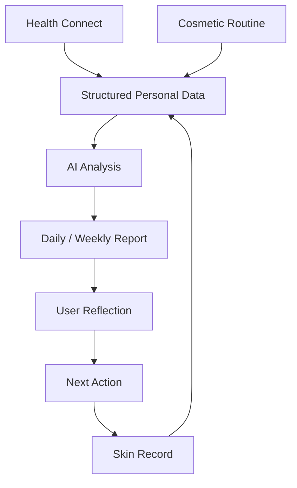

## ① Real Health Data

단순 Demo용 숫자를 임의로 생성하는 것이 아니라 Android **Health Connect**와 실제 Application Flow를 연결합니다.

---

## ② AI as an Analysis Layer

AI Chat 자체가 서비스의 목적이 아닙니다.

```text
Personal Data
      ↓
Validation
      ↓
Structured Context
      ↓
AI
      ↓
Validation
      ↓
Report
```

AI는 여러 종류의 사용자 데이터를 이해하기 쉬운 형태로 정리하는 **Analysis Layer**로 활용합니다.

---

## ③ Continuous Wellness Loop

```text
Record
   ↓
Analyze
   ↓
Reflect
   ↓
Act
   ↓
Record Again
```

일회성 AI 응답이 아니라 지속적인 기록을 통해 개인 History가 만들어지는 구조입니다.

> **Track: [공식 제출 트랙명 입력]**

---

# 20. Project Structure

이 Repository에는 **Spring Backend와 Android Native Integration Layer**가 함께 있습니다.

```text
14th-toMeta-backend
│
├── 📂 src
│   ├── main
│   │   ├── java/com/likelion/tometa
│   │   │   │
│   │   │   ├── 📂 domain
│   │   │   │   ├── common
│   │   │   │   ├── cosmetic
│   │   │   │   ├── health
│   │   │   │   ├── home
│   │   │   │   ├── mypage
│   │   │   │   ├── onboarding
│   │   │   │   ├── record
│   │   │   │   ├── report
│   │   │   │   ├── tip
│   │   │   │   └── user
│   │   │   │
│   │   │   └── 📂 global
│   │   │       ├── code
│   │   │       ├── config
│   │   │       ├── exception
│   │   │       └── response
│   │   │
│   │   └── resources
│   │       ├── application.yaml
│   │       └── db/migration/mysql
│   │
│   └── test
│       └── java/com/likelion/tometa
│
├── 📱 android
│   └── app
│       └── src/main/java/com/likelion/tometa
│           ├── healthconnect
│           │   ├── background
│           │   ├── device
│           │   └── model
│           └── webview
│
├── 📚 docs
│   ├── api
│   └── tutorial
│
├── 📂 infra
│
├── Dockerfile
├── docker-compose.yml
├── docker-compose.firebase.yml
├── build.gradle
├── .coderabbit.yaml
├── gradlew
└── gradlew.bat
```

---

# 21. Getting Started

<details>
<summary><b>📌 1. Requirements</b></summary>

<br/>

### Backend

```text
Java 21
Docker
Docker Compose
```

### Android

```text
Android Studio
Android SDK
Health Connect 지원 Android Device
```

</details>

---

<details>
<summary><b>📥 2. Clone Repository</b></summary>

<br/>

```bash
git clone https://github.com/LikeLionUniv-INU/14th-toMeta-backend.git

cd 14th-toMeta-backend
```

개발 브랜치를 사용할 경우:

```bash
git checkout dev
```

</details>

---

<details>
<summary><b>🔐 3. Environment Variables</b></summary>

<br/>

주요 환경변수는 다음과 같습니다.

```env
# ==================================================
# MySQL
# ==================================================

MYSQL_ROOT_PASSWORD=
MYSQL_DATABASE=
MYSQL_APP_USER=
MYSQL_APP_PASSWORD=

SPRING_DATASOURCE_USERNAME=
SPRING_DATASOURCE_PASSWORD=


# ==================================================
# Flyway
# ==================================================

FLYWAY_BASELINE_ON_MIGRATE=false


# ==================================================
# Cookie / CORS
# ==================================================

COOKIE_SECURE=true
CORS_ALLOWED_ORIGINS=


# ==================================================
# AWS S3
# ==================================================

AWS_S3_BUCKET=
AWS_REGION=ap-northeast-2

AWS_ACCESS_KEY_ID=
AWS_SECRET_ACCESS_KEY=


# ==================================================
# OpenAI
# ==================================================

OPENAI_API_KEY=
OPENAI_MODEL=gpt-5-mini
```

> [!WARNING]
> OpenAI API Key, AWS Secret, Firebase Credential 등 실제 Secret 값은 Repository에 Commit하지 않습니다.

</details>

---

<details>
<summary><b>🐳 4. Run with Docker Compose</b></summary>

<br/>

### Build & Start

```bash
docker compose up -d --build
```

### Container Status

```bash
docker compose ps
```

### Application Log

```bash
docker compose logs -f app
```

### MySQL Log

```bash
docker compose logs -f mysql
```

### Stop

```bash
docker compose down
```

### Stop + Remove Volume

```bash
docker compose down -v
```

> `-v` 옵션은 MySQL Data Volume까지 제거합니다.

</details>

---

<details>
<summary><b>☕ 5. Run Spring Locally</b></summary>

<br/>

MySQL이 실행된 상태에서:

```bash
./gradlew bootRun
```

</details>

---

<details>
<summary><b>🔨 6. Build</b></summary>

<br/>

```bash
./gradlew clean build
```

Boot JAR만 생성:

```bash
./gradlew bootJar
```

</details>

---

<details>
<summary><b>🧪 7. Test</b></summary>

<br/>

```bash
./gradlew test
```

Build와 Test를 함께 실행하려면:

```bash
./gradlew clean build
```

</details>

---

# 22. Team ToMeta

<div align="center">

### 👥 낫트데이를 만드는 사람들

**Planning · Design · Frontend · Backend**

</div>

<br/>

| Profile | Name | Role |
| :---: | :---: | :---: |
| 👤 | **강한별** | Planning |
| 🎨 | **박서현** | Design |
| [](https://github.com/jiyoeo) | [**김지연**](https://github.com/jiyoeo) | Frontend |
| [](https://github.com/namyoon0418) | [**김남윤**](https://github.com/namyoon0418) | Frontend |
| [](https://github.com/yim0327) | [**임재영**](https://github.com/yim0327) | Backend |
| [](https://github.com/tnqlsdl123) | [**장수빈**](https://github.com/tnqlsdl123) | Backend |

<br/>

### GitHub Contributors

<div align="center">

<a href="https://github.com/LikeLionUniv-INU/14th-toMeta-backend/graphs/contributors">
  
</a>

</div>

---

# 23. References

## Research

**[1] Tan J.K.L., Bhate K.**  
*A global perspective on the epidemiology of acne.*  
British Journal of Dermatology, 2015.  
PMID: `25597339`

**[2] Meixiong J. et al.**  
*Diet and acne: A systematic review.*  
JAAD International, 2022.  
PMID: `35373155`

---

## Platform

**[3] Android Developers**  
*Health Connect — Android Health & Fitness*

Health Connect는 사용자 권한을 기반으로 여러 Health / Fitness Application의 데이터를 표준화된 방식으로 연결할 수 있도록 제공하는 Android Platform입니다.

---

## Market

**[4] 식품의약품안전처**  
*'24년 화장품 생산·수출액, 모두 사상 최대실적 기록*, 2025.

2024년 국내 화장품 생산실적은 약 **17조 5,426억 원**을 기록했습니다.

---

# Disclaimer

> [!IMPORTANT]
> **낫트데이는 의료 서비스가 아닌 Wellness 서비스입니다.**
>
> 서비스에서 제공하는 AI 분석 및 생활 가이드는 의료인의 진단, 치료 또는 처방을 대체하지 않습니다.  
> 피부 질환에 대한 정확한 진단이나 치료가 필요한 경우 의료 전문가와 상담해야 합니다.

---

<div align="center">

### 🧴 피부를 기억하지 말고, 기록하세요.

## 낫트데이 · Not Trouble Day

**Collect · Validate · Analyze · Reflect**

<br/>

<sub>Made with 🌿 by Team ToMeta</sub>

<br/><br/>

[](https://github.com/LikeLionUniv-INU/14th-toMeta-frontend)
[](https://github.com/LikeLionUniv-INU/14th-toMeta-backend)

</div>


